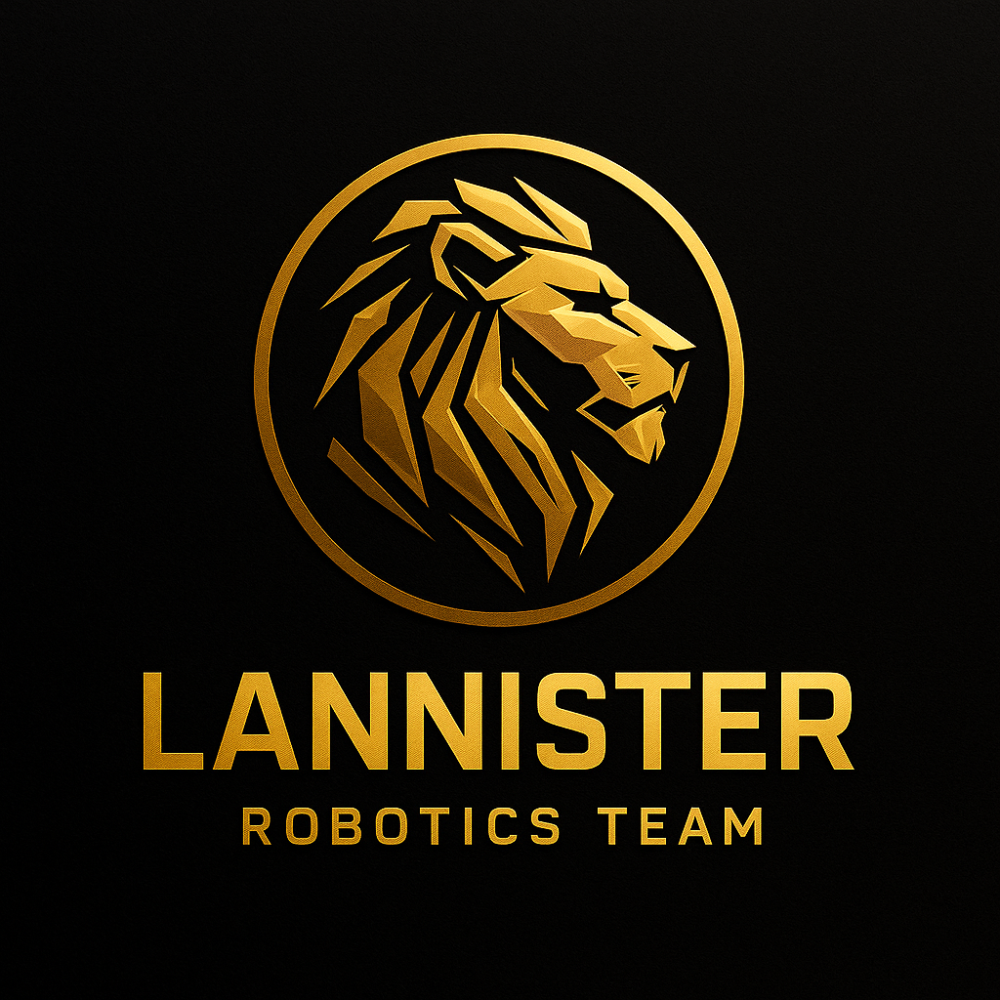
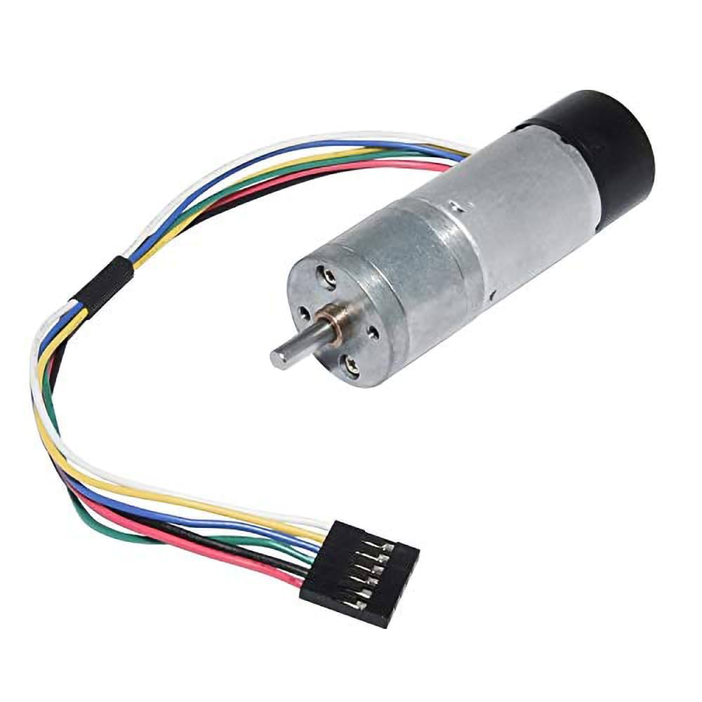

<h1 align="center"><strong>Lannister Team</strong></h1>

<strong>WRO 2025 Local Final: Future Engineers</strong>

  

  This is the official repository of <strong>Team Lannister</strong> for the international final of the <strong>WRO2025</strong> season.

# Engineering Materials Repository

This repository contains all materials related to our engineering vehicle project for the competition. The content is organized into several folders as described below.

---

## 📁 Folder Structure

### `t-photos`
- Contains **2 team photos**:
  - An **official team photo**.
  - A **funny photo** with all team members.

### `v-photos`
- Contains **6 photos of the vehicle**:
  - Captured from **every side**, as well as from the **top and bottom**.

### `video`
- Contains a `video.md` file with a **link to a demonstration video** showing the vehicle in action.

### `schemes`
- Contains **schematic diagrams** in **JPEG**, **PNG**, or **PDF** format.
- Illustrates all **electromechanical components** used in the vehicle:
  - Electronic components
  - Motors
  - Wiring and connections between them

### `src`
- Contains the **source code** for the control software.
- Includes all components programmed to participate in the competition.

### `models`

- Contains **illustrative diagrams and conceptual models** related to the mechanical design of the robot, including:
  - *Ackermann Steering System in Our WRO 2025 Car*
  - *Differential Gear System in Our WRO 2025 Car*
- These models are used for documentation and explanation purposes only, and do not include 3D-printable or CNC-ready files.
- This folder helps visualize how steering and torque distribution are mechanically implemented in the vehicle.

### `media`
- Contains **images and diagrams** used throughout the documentation, including:
  - Photos of hardware components (motors, sensors, controllers, etc.)
  - System wiring diagrams or mechanical schematics
  - Illustrations for the README and other documentation
- May also include other helpful files such as:
  - Datasets
  - Connection instructions to SBC/SBM
  - Hardware specifications and communication protocols

---

## 🎯 Purpose

This structure ensures clear organization and ease of navigation for anyone working on, reviewing, or evaluating the engineering project.

Introduction
Hello, Team Lannister here, let's go a deeper into how this seasons robot is made up !!

### 🚗 Mobility Management Components

|  |  |
|:----------------------------------:|:-------------------------------------------------:|
| **Servo Motor**   • Weight: 12g   • Dimensions: 23 x 11.5 x 24 mm   • Stall torque: 1.6 kgf·cm at 4.8V  • Speed: 0.12s/60° at 4.8V (no load)  • Stall torque: 2.0 kgf·cm at 6.0V  • Speed: 0.10s/60° at 6.0V (no load)  • Rotational range: 180°  • Pulse cycle: ~20ms  • Pulse width: 500–2400 µs | **DC 12V Encoder Gearmotor**   • Up to 200 RPM  • Stall torque (extrapolated): 21 kgf·cm  • 50:1 integrated gearbox  • No load current: 0.2A at 12V  • Stall current: 5.5A at 12V |

### ⚙️ Motor Integration and Drive System

To ensure proper implementation of the **DC 12V encoder gear motor** and the **servo motor**, both a **motor driver** and a **mechanical differential** were selected as essential components of the drive system.

The encoder gear motor is responsible for powering the mechanical differential, which then distributes motion evenly to the rear wheels. This configuration was chosen due to the torque multiplication offered by the differential — a key factor for achieving **precise maneuverability** within constrained environments, such as a competition playing field.

The integrated **gear reduction system** in the motor provides several advantages:
- Simplified mechanical design
- Enhanced power and torque output
- High durability due to the **sealed and enclosed housing**

This combination of components enables smooth, responsive, and reliable mobility suitable for both fine control and sustained movement under varying load conditions.

#### 📸 Drive System Overview

### 🔌 System Elements Overview

This section outlines the main hardware components integrated into the robot, including control units, sensors, power elements, and motor drivers.

---

#### 🧠 Microcontrollers and Computing Units

### Arduino Uno

The Arduino Uno serves as the main microcontroller responsible for low-level control tasks such as motor actuation and sensor data acquisition. It interfaces directly with the motor driver, sensors, and power supply through individual wiring and connections without the use of a custom shield.

Connections are managed via standard Arduino input/output pins, with careful wiring to ensure stable power distribution and reliable communication with all peripheral components.

- **Raspberry Pi 5 (Model B)**  
  The Raspberry Pi 5 serves as the high-level processing unit, handling tasks such as path planning, camera data processing, and advanced control logic. Model B features a quad-core ARM Cortex-A76 processor running at 2.4GHz, up to 8GB RAM, dual 4K display output, USB 3.0 support, Gigabit Ethernet, built-in Wi-Fi and Bluetooth 5.0.

---

#### 📷 Vision System

- **Raspberry Pi Camera Module**  
  The robot is equipped with the official Raspberry Pi Camera Module, providing real-time video input for image-based navigation or line-following tasks. The camera is directly connected to the Pi via the CSI interface for low-latency image capture.

---

#### ⚙️ Motors and Actuation

- **Motors Configuration**  
  The robot includes:
  - **1 DC Encoder Gearmotor** for rear-wheel drive (forward and backward motion).
  - **1 SG90 Servomotor** for steering the front wheels (left/right movement).

  These motors work together to allow omnidirectional navigation on a flat surface. Specifications include:
  - Torque: ~35 g·cm
  - Speed range: 0.22 m/s (min) – 0.71 m/s (max)  
  *(Note: 0.22 m/s is the robot's minimum effective speed; the motor itself can operate slower.)*

---

#### 🔄 Motor Driver

- **L298N Dual H-Bridge Motor Driver**  
  The L298N module is used to control the DC and servo motors. It consists of:
  - An L298 integrated motor driver IC
  - A 78M05 5V regulator (can be disabled via jumper)
  
  Features:
  - Can control up to 2 DC motors (direction + speed)
  - Can support 4 motors with simple on/off logic
  - Compatible with TTL logic levels (from Arduino or Pi)

---

#### 📏 Distance and Motion Sensing

- **HC-SR04 Ultrasonic Sensors**  
  The robot uses **3 ultrasonic sensors** placed at the front, left, and right to detect obstacles and measure distances. Each sensor operates as follows:
  - Emits 8 ultrasonic pulses at 40kHz via the TRIG pin.
  - Detects reflected sound using the ECHO pin.
  - Measures time of flight to calculate distance (2–450 cm range).
  
  These sensors are not affected by sunlight or dark materials, but may struggle with acoustically soft surfaces (e.g., cloth or wool).

- **IMU Sensor (Inertial Measurement Unit)**  
  The robot includes an IMU sensor (e.g., MPU6050 or similar) that provides motion data through **gyroscope and accelerometer readings**. This allows:
  - Orientation tracking
  - Tilt detection
  - Smoother navigation control (especially in turns or uneven motion)

  The IMU is connected via I2C to the Arduino, which processes raw motion data or forwards it to the Raspberry Pi for sensor fusion and decision making.

---

#### 🔋 Power Supply

- **9V Battery Supply**  
  The robot is powered using a **9V battery**, which is connected through the custom Arduino shield to distribute power appropriately:
  - Motors receive power through the L298N driver module.
  - Logic-level devices (Arduino, sensors) receive regulated 5V from the onboard voltage regulators.
  
  Separation of motor and logic power ensures **stable performance**, reduces noise, and protects against voltage dips during motor stall.

### 💻 Coding Environments

The robot's software is developed using two main programming environments: **Arduino IDE (C++)** and **Python**. Each environment is responsible for different layers of control, from low-level motor actuation to high-level vision processing.

---

#### 🔧 Arduino IDE (C++)

The **Arduino Integrated Development Environment (IDE)** is a cross-platform application (available for Windows, macOS, and Linux) used to program Arduino-compatible boards. Written in Java, the IDE supports both C and C++ languages with simplified structure requirements.

Key features:
- Provides built-in libraries for common I/O operations (based on the Wiring framework).
- Requires only two user-defined functions: `setup()` for initialization and `loop()` for continuous execution.
- Uses the GNU toolchain to compile code, and **AVRDUDE** to upload the hex-encoded binary to the board.

**Role in the project:**
- The Arduino IDE is used to program the **Arduino Uno**, which directly controls:
  - Rear-wheel drive motion
  - Steering through the servo motor
- These actions are performed based on movement commands received from the Raspberry Pi Camera (e.g., left/right turns or forward/backward motion).

---

#### 🐍 Python

**Python** is a high-level, interpreted programming language known for its readability and flexibility. It supports multiple programming paradigms (object-oriented, imperative, and limited functional) and is widely used in modern applications like **Instagram**, **Netflix**, and **Spotify**.

**Role in the project:**
- Python runs on the **Raspberry Pi 5** and is responsible for:
  - **Camera input handling**
  - **Color and object detection**
  - **Sending motion commands** to the Arduino Uno based on visual analysis

This separation of roles allows for modular and efficient robot behavior, combining real-time sensor feedback with high-level decision making.

