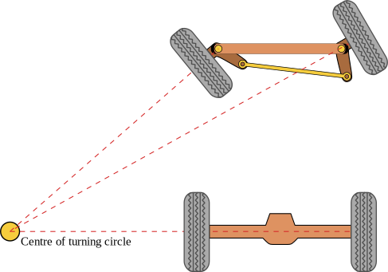
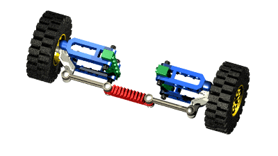

# Ackermann Steering System in Our WRO 2025 Car

## What is Ackermann Steering?

The Ackermann steering geometry is a design principle used to allow the front wheels of a vehicle to follow different turning radii during a turn, this is crucial because the inner wheel must turn more sharply than the outer wheel, so that both wheels point toward a shared center of rotation, this reduces tire slippage and improves control, especially during tight maneuvers.



## Why We Use It in Our Car

In our WRO 2025 self-driving car, we implemented an Ackermann style steering system to closely mimic the behavior of real vehicles, This makes the car:
- More realistic
- Better at handling curves and corners
- Smoother during autonomous path following

Our system is actuated by a single servo motor, mounted at the bottom of the chassis. The servo is connected to a mechanical linkage that distributes the turning angles to the two front wheels, based on the Ackermann principle.



## Geometry and Math Behind It

The concept is based on aligning all wheels toward a common turning point. The steering angles of the inner and outer front wheels can be calculated as:

```
tan(θ_in)  = L / (R - W/2)  
tan(θ_out) = L / (R + W/2)
```

Where:
- `θ_in` is the angle of the inner wheel
- `θ_out` is the angle of the outer wheel
- `L` is the wheelbase (distance between front and rear axles)
- `W` is the track width (distance between left and right front wheels)
- `R` is the turning radius from the center of the car to the turning center

This setup ensures that both front wheels are aligned with their respective turning circles, reducing friction and improving accuracy.

## Real Application in Our Design

In our 3D printed chassis:
- The **servo motor** is mounted at the bottom and connected to a **steering linkage**
- The **linkage arms** are carefully angled to match the required difference between the left and right wheel steering angles
- We tested this system to ensure both smooth turning and reliable mechanical response at low speeds