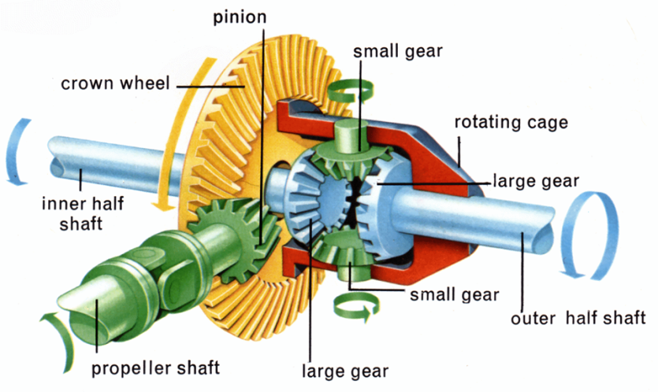

# Differential Gear System in Our WRO 2025 Car

## What is a Differential?

A differential is a smart mechanical component that allows two wheels to rotate at different speeds while still receiving power from the same motor, This becomes really important when the car turns, because the outer wheel has to travel a longer path and therefore needs to spin faster than the inner one. Without a differential, both wheels would be locked to the same speed, which causes dragging, skidding, or even poor turning performance.

## Why We Use It in Our Car

Our WRO 2025 self-driving car uses only one DC motor to drive both rear wheels. This keeps the system simple and efficient, but also means we need a way to let the wheels behave differently when turning. That's where the differential comes in. It lets the inner and outer wheels spin at the speed they need, making turns smooth and controlled, improving grip, and making the whole movement feel more natural and car-like.

## How It Works (Simple Explanation)

Inside a differential, there's a central gear that receives power from the motor, and two side gears that connect to the left and right wheels. A set of small bevel gears inside lets these side gears rotate at different speeds. When driving straight, both wheels spin together. But when turning, the differential adjusts how fast each wheel spins based on the car’s motion, so everything stays balanced and stable without losing traction.

## Implementation in Our Design

In our case, we 3D printed a custom differential that sits between the two rear wheels. It’s powered by a 10-tooth gear from the DC motor, which drives a 20-tooth gear on the differential itself. This setup gives us a bit more torque and better control, which helps especially during slow and precise movements required in autonomous driving tasks. It also makes the car behave more like a real vehicle, which is something we aim for in both design and performance.
