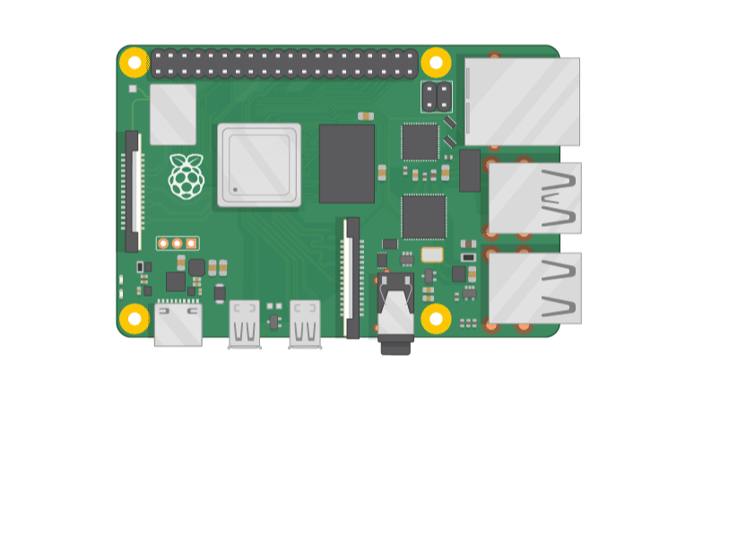

# Arduino and Raspberry PI 5

## What is an SBC?

A **Single-Board Computer (SBC)** is a complete computer built on a single circuit board. It contains a processor, memory, storage interfaces, and often networking capabilities. Unlike microcontrollers, SBCs run full operating systems and can handle complex tasks like image processing, artificial intelligence, and multitasking.

## What is the Raspberry Pi 5?

The **Raspberry Pi 5** is the latest generation of the Raspberry Pi family as of 7/15/2025 (mm/dd/yyyy). It's a powerful, compact, and affordable SBC designed for projects ranging from education to advanced robotics.

### Hardware Specs (Our Raspberry Pi 5 - 8GB):
- Quad-core ARM Cortex-A76 CPU @ 2.4GHz
- 8 GB LPDDR4X RAM
- CSI port for camera
- USB 3.0, USB-C power, GPIO header (40 pins)
- MicroSD storage
- Supports HDMI, Ethernet, and Bluetooth/WiFi

## Why We Use Raspberry Pi in Our WRO Car

We use the Raspberry Pi 5 as the **main brain** of our WRO 2025 car. Its role includes:
- Capturing video from the Pi Camera using the CSI interface
- Running image processing with OpenCV to detect traffic colors and shapes
- Sending these commands to the Arduino Uno over UART serial communication

The Pi runs a full Linux OS, giving us access to powerful libraries for AI, machine learning, and computer vision. It's ideal for handling non-real-time but complex tasks that require high processing power and memory.

---

## What is a Microcontroller?

A **microcontroller** is a compact integrated circuit that contains a processor core, memory, and I/O peripherals on a single chip. It's designed for real-time control tasks like reading sensors or driving motors.

## What is an Arduino?

**Arduino Uno** is a widely-used microcontroller board based on the ATmega328P. It features 14 digital I/O pins (6 of which can do PWM), 6 analog inputs, and a simple USB interface for programming. It doesn’t run an operating system — instead, it executes code written in Arduino C++ directly from memory, making it fast and predictable.

## Why We Use Arduino in Our WRO Car

The Arduino Uno is used as the **low-level controller** of our car. It handles:
- Reading sensors like ultrasonic distance sensors and the MPU6050 IMU
- Controlling actuators like the DC motor (via L298N H-bridge) and the servo motor for steering
- Receiving high-level commands from the Raspberry Pi and translating them into precise movements

Arduino is reliable, power-efficient, and perfect for real-time applications where fast and consistent pin response is needed.

---

## Comparison: Raspberry Pi 5 vs. Arduino Uno

| Feature                 | Raspberry Pi 5                       | Arduino Uno                         |
|------------------------|--------------------------------------|--------------------------------------|
| Type                   | Single-Board Computer (SBC)          | Microcontroller                      |
| CPU                    | Quad-core Cortex-A76 @ 2.4GHz        | 8-bit AVR @ 16MHz                    |
| RAM                    | 8 GB LPDDR4X                         | 2 KB SRAM                            |
| Operating System       | Full Linux OS (Raspberry Pi OS)      | None (bare-metal code)               |
| Programming Language   | Python, C++, Java, etc.              | Arduino C/C++                        |
| Real-time Control      | Not deterministic                    | Very good (deterministic behavior)   |
| I/O Pins               | 40 GPIO                              | 14 digital, 6 analog                 |
| Power Requirement      | 5V @ 3A (USB-C)                      | 5V @ ~50mA via USB                   |
| Ideal For              | AI, image processing, decision logic | Motor control, sensors, real-time I/O|
| Cost                   | Higher (~$60–$80)                    | Lower (~$10–$20)                     |

## Summary
At summary, both **Arduino** and **RPI5** is a powerful devices and will help us in the WRO 2025, the will communicate through UART via serial USB
